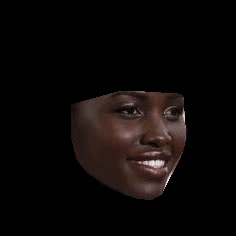

# README

Authors: Bryan Reynolds, Patrick Thomas

End-to-end face key point detection and morphing.
The below demo uses no prior keypoint alignment via SVD and removes background points.

 
[Video demo here.](https://uillinoisedu-my.sharepoint.com/:v:/g/personal/pwt2_illinois_edu/EYkcQO4sUjJGj450dLeOgSsBRiT9httLjgS4H4DKeY50iA?nav=eyJyZWZlcnJhbEluZm8iOnsicmVmZXJyYWxBcHAiOiJPbmVEcml2ZUZvckJ1c2luZXNzIiwicmVmZXJyYWxBcHBQbGF0Zm9ybSI6IldlYiIsInJlZmVycmFsTW9kZSI6InZpZXciLCJyZWZlcnJhbFZpZXciOiJNeUZpbGVzTGlua0NvcHkifX0&e=TS69E4)
Requires UIUC MS365 login.

## Automatic Image Morph

### Prereqs

- Environment: Python 3.11
  - Recommended: use `miniconda`, after installing, run:
    ```sh
    conda env update -f ./environment-cpu.yml
    conda activate cs445
    ```
  - And then run the notebook from VSCode
- `best_model.keras` needs to be downloaded from the shared drive - visit
  <https://uofi.box.com/s/91nmvn5vcr00q5hzp1nzajd81g2w4s29> and download the
  file to the root of the repo

### Usage

Other than a 'display images' function and importing libraries in the beginning
of the notebook, the main code has been simplified and consists of the basic
block below:

```py
importlib.reload(warper)
importlib.reload(FaceWrapper)
import config
importlib.reload(config)
parameters={
        "face1": "<filepath to face 1 image>",
        "face2": "<filepath to face 2 image>",
        "align": True,
        "addBackgroundPoints": False,

  }
Sequence = FaceWrapper.ParappaTheFaceWrappa(parameters)
Sequence.setup_faces()

# Choose just one of the below to uncomment

#images=Sequence.typical_morph()
#images=Sequence.typical_interpolate_morph()

display_images(images)
```

The only thing to modify is the parameters and which morph the user would like
to do. The user can do a face morph that interpolates head poses as well as
morphs by choosing 'typical_interpolate_morph'. The user can also instead choose
'typical_morph' which morphs based on current existing morphing sequences. The
interpolating head poses Sequence is part of our innovative challenge, and may
not run as smooth as typical morph. Any face images can be used. If the images
are different sizes, the largest image will be resized to match the size of the
smallest one. The application will also force images to be square and resized to
256x256 to decrease loading times.

When running the morph sequence, it will display a strip of frames to
demonstrate the morph at different levels. Making background points False in the
parameters will provide the smoothest morph as the background is not part of the
keypoints, but it will still morph well.

## Parameters

Standard Parameters by default will look like this:

```py
parameters={
        "face1": "<filepath to face 1>",
        "face2": "<filepath to face 2",
        "align": True,
        "addBackgroundPoints": True,

  }
```

### Face1 :

filepath to face 1 image, such as BradPitt.jpg

### Face2 :

filepath to face 2 image, such as BradPitt.jpg

### align :

aligns images before morphing, so that keypoints in two different images will be
alike

### addBackgroundPoints :

Adds background keypoints at corners and sides of images. This is done to
smoothly cross dissolve any part of the image not part of the face-detected
keypoints, such as the forehead oractual background

## Run an interpolated head-pose + Face Morph Sequence

For a morph involving head interpolation + face morphing(part #2 of our
innovation), use the recommended parameters below.

```py
parameters={
        "face1": "<filepath to face 1>",
        "face2": "<filepath to face 2",
        "align": True,
        "addBackgroundPoints": True

  }
images=Sequence.typical_interpolate_morph()
```

## Run a standard morph

To see a standard morph, set "align" to True and uncomment "typical_morph". The
recommended parameters are below. This DOES NOT contain head interpolation, but
can be used if the two faces are already facing the front

```py
parameters={
        "face1": "<filepath to face 1>",
        "face2": "<filepath to face 2",
        "align": True,
        "addBackgroundPoints": True

  }
Sequence.typical_morph()
```

## Generating multiple morph videos at once

A quick way to generate multiple morph videos at once is to use `quad_plot.py`:

```sh
mkdir -p output/videos
python3 quad_plot.py
```

This requires that the `best_model.keras` file is in the root of the repo, the
pranshantarorat facial key point images are in
`data/prashantarorat/facial-key-point-data/`, and the 3D face model is at
`m.h5`. The script will generate 4 morph videos in the `output/videos`
directory. You can change the images used in the script to generate different
morphs in `quad_plot.py`.

Sampel outputs are in `output_videos` here:
<https://uofi.box.com/s/91nmvn5vcr00q5hzp1nzajd81g2w4s29> (requires UIUC Box
login).

## Training

### SSD Method

Dataset:
<https://www.kaggle.com/datasets/drgilermo/face-images-with-marked-landmark-points/data>

Pulling the data:

```sh
mkdir -p data
curl -L -o data/face-images-with-marked-landmark-points.zip \
  https://www.kaggle.com/api/v1/datasets/download/drgilermo/face-images-with-marked-landmark-points
unzip data/face-images-with-marked-landmark-points.zip -d ./data
```

Then run `face-detection-ssd.ipynb` to build the model and evaluate its
performance. This takes approximately 15 minutes in all to run with with a
moderately powerful laptop.

### CNN Method

First get the data
(<https://www.kaggle.com/datasets/prashantarorat/facial-key-point-data>):

```sh
mkdir -p ./data/prashantarorat/facial-key-point-data
curl -L -o \
  ./data/prashantarorat/facial-key-point-data/facial-key-point-data.zip \
  https://www.kaggle.com/api/v1/datasets/download/prashantarorat/facial-key-point-data
unzip ./data/prashantarorat/facial-key-point-data/facial-key-point-data.zip -d ./data/prashantarorat/facial-key-point-data
```

See `face-detection-cnn.ipynb` for model training. Note that you will need a
powerful GPU with 6Gb+ of video memory to train the model.

For simply evaluating the model, you can use the pre-trained model from
[the Box drive](https://uofi.box.com/s/91nmvn5vcr00q5hzp1nzajd81g2w4s29).
Download the model file to `best_model.keras` in the root of the repo. Then see
`sample-model-usage.ipynb` model usage or `face-detection-evaluation.ipynb` for
the model's performance evaluation.

## Resources

- Face Images with Marked Landmark Points
  <https://www.kaggle.com/datasets/drgilermo/face-images-with-marked-landmark-points/data>
- Facial Key Point Data Set
  <https://www.kaggle.com/datasets/prashantarorat/facial-key-point-data>
- Basal face 3d model
  <https://faces.dmi.unibas.ch/bfm/index.php?nav=1-1-0&id=details>

<!-- - Large Scale CelebA Dataset <https://mmlab.ie.cuhk.edu.hk/projects/CelebA.html> -- unused -->
